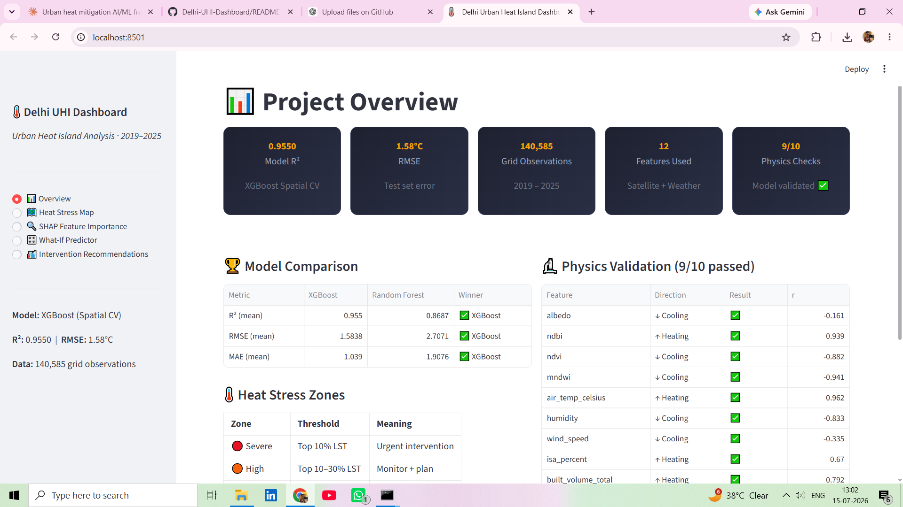
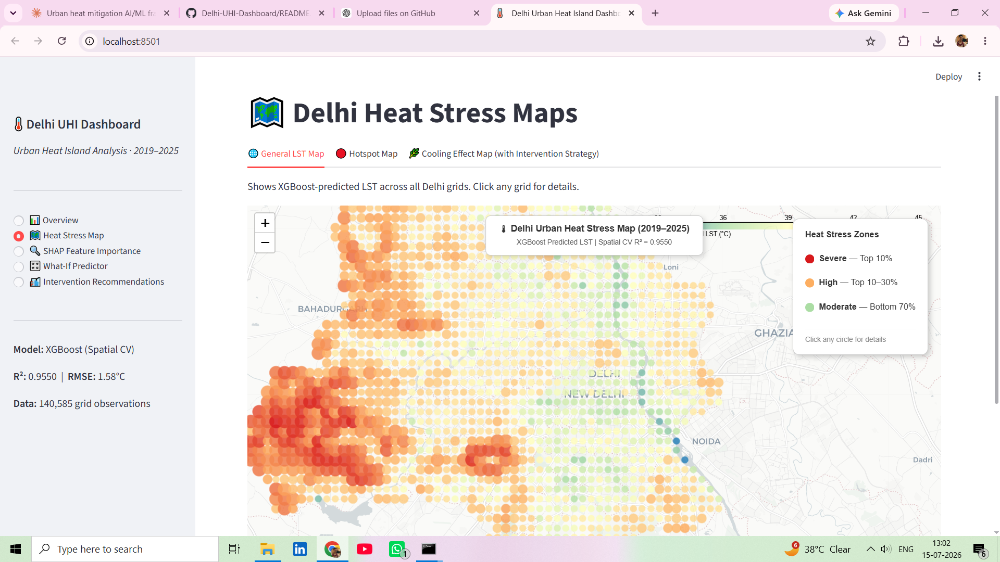
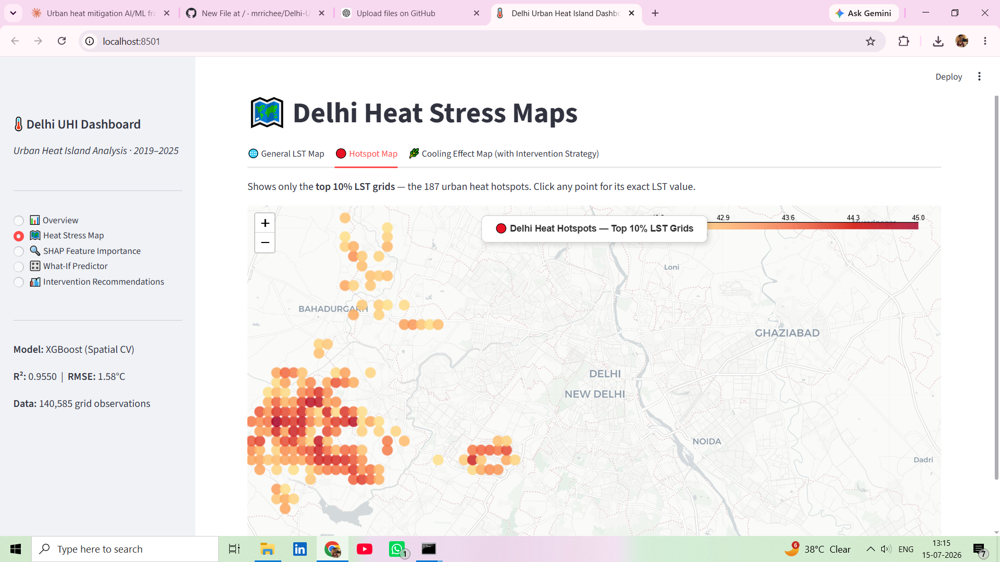
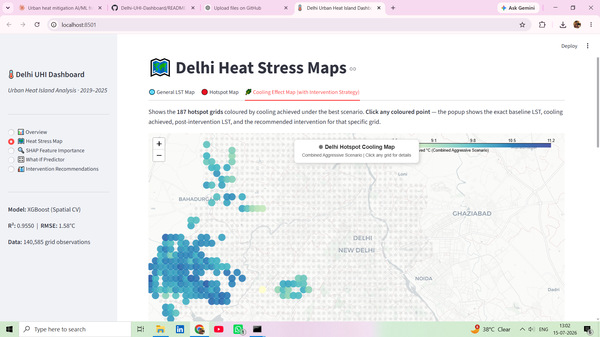
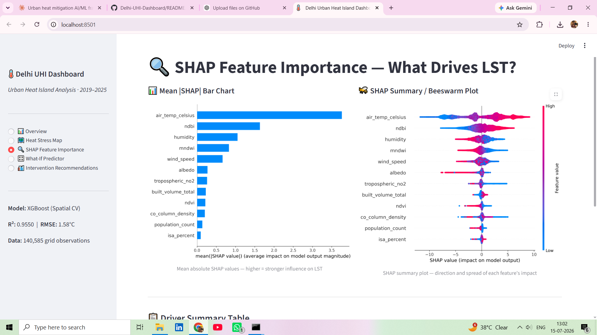
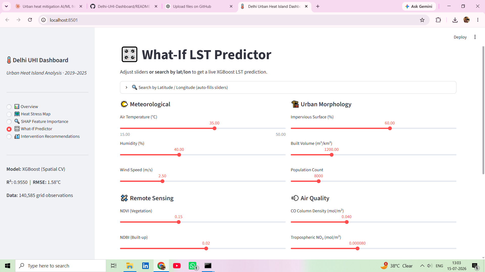
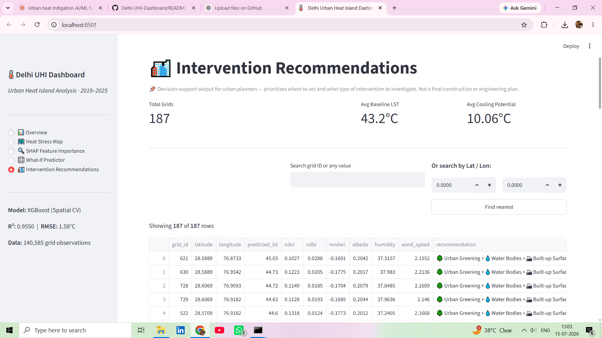

# 🌡️ Delhi Urban Heat Island — AI/ML Mitigation Dashboard

> **Physics-informed Explainable AI System for Urban Heat Stress Mapping, Hotspot Detection and Cooling Intervention Planning for Delhi NCR**

---

## 🚀 Live Dashboard

👉 https://delhi-uhi-dashboard.streamlit.app

---

## 📸 Dashboard Preview

### Project Overview

### Heat Stress Mapping

### Hotspot Detection

### Cooling Effect Map

### SHAP Explainability

### What-if Predictor

### Intervention Recommendations

---

## 📖 Project Overview

This project presents a complete **AI/ML-powered Urban Heat Island (UHI) Decision Support System** developed for **Delhi NCR**.

Using satellite imagery, meteorological observations, urban morphology, and air-quality indicators, the system predicts **Land Surface Temperature (LST)**, identifies urban heat hotspots, explains the physical drivers of heating using SHAP, and recommends optimized cooling interventions for each hotspot grid.

The dashboard provides interactive visualizations that help researchers, planners, and policymakers explore heat stress patterns and evaluate mitigation strategies.

## ✨ Key Features

### 🌍 Geospatial Heat Mapping
- Predicts Land Surface Temperature (LST) across **1,858 spatial grids** covering Delhi NCR.
- Interactive geospatial visualization using Folium maps.

### 🔥 Urban Heat Hotspot Detection
- Automatically identifies the **Top 10% highest-temperature grids**.
- Categorizes regions into **Severe**, **High**, and **Moderate** heat stress zones.

### 🧠 Explainable Artificial Intelligence
- Uses **SHAP (SHapley Additive Explanations)** to quantify the contribution of each environmental and urban feature.
- Provides both **global** and **local** model interpretability.

### 📈 Scenario-Based Cooling Simulation
Evaluates multiple mitigation strategies, including:
- 🌳 Urban Greening
- 💧 Water Body Restoration
- ☀️ Cool Roofs
- 🏙️ Built-up Surface Treatment
- 🚀 Combined Intervention Scenario

### 🎛️ Interactive What-if Predictor
- Modify environmental and urban variables using sliders.
- Instantly observe the predicted Land Surface Temperature.

### 🏛️ Decision Support System
- Generates grid-level intervention recommendations.
- Helps planners prioritize mitigation strategies based on predicted cooling potential.
  
## 📊 Model Performance

| Metric | Value |
|--------|-------:|
| Spatial Cross Validation R² | **0.9550 ± 0.0021** |
| Test R² | **0.9697** |
| Test RMSE | **1.32°C** |
| Mean Absolute Error | **1.04°C** |
| Physics Validation | **9 / 10 checks passed** |

## 🛰️ Data Sources
| Source | Variables |
|--------|-----------|
| Landsat 8 | Land Surface Temperature |
| Sentinel-2 | NDVI, NDBI, MNDWI, Albedo |
| ERA5 / CPCB | Air temperature, humidity, wind speed |
| Sentinel-5P | NO₂, CO, SO₂ column density |
| GHSL / UT-GLOBUS | Built volume, impervious surface |

## 🏙️ Cooling Interventions Modelled
- 🌿 Urban Greening (NDVI +0.10) → ~1.5°C mean cooling
- 💧 Water Body Enhancement (MNDWI +0.10) → ~3.4°C mean cooling
- ☀️ Cool Roofs / Albedo increase (+0.10) → ~1.2°C mean cooling
- 🏗️ Built-up Surface Treatment (NDBI -0.05) → ~2.7°C mean cooling
- 🔗 Combined Aggressive scenario → maximum cooling

## 🚀 Run Locally
\`\`\`bash
pip install -r requirements.txt
streamlit run dashboard.py
\`\`\`

## 📁 Key Output Files
- `delhi_heat_stress_map.html` — interactive LST map (all grids)
- `delhi_hotspots_map.html` — top 10% hotspot grids
- `delhi_cooling_map.html` — per-grid cooling after intervention
- `optimal_intervention_strategy_v2.csv` — full strategy table

## ⚙️ Tech Stack
Python · XGBoost · SHAP · Folium · Streamlit · 
Pandas · Scikit-learn · Google Earth Engine (data collection)
